# Spring Cloud Gateway 源码深度分析

> 基于 `spring-cloud-gateway-core 2.1.1.RELEASE`（对应 Spring Cloud Hoxton.SR12）
> 本项目 gateway-server 使用 `spring-cloud-starter-gateway` + `spring-cloud-starter-alibaba-sentinel` + Nacos

---

## 目录

1. [整体架构](#1-整体架构)
2. [核心组件总览](#2-核心组件总览)
3. [路由定义与加载机制](#3-路由定义与加载机制)
4. [路由转发底层原理](#4-路由转发底层原理)
5. [过滤器链机制](#5-过滤器链机制)
6. [Filter 执行顺序详解](#6-filter-执行顺序详解)
7. [Predicate 断言机制](#7-predicate-断言机制)
8. [请求处理完整时序](#8-请求处理完整时序)
9. [底层通信原理](#9-底层通信原理reactor-netty)
10. [本项目源码结合分析](#10-本项目源码结合分析)
11. [关键源码类索引](#11-关键源码类索引)
12. [lb 协议路由转发原理](#12-lb-协议路由转发原理)

---

## 1. 整体架构

Spring Cloud Gateway 是基于 **Spring WebFlux + Reactor Netty** 构建的响应式 API 网关。它**不依赖 Servlet 容器**（如 Tomcat），而是运行在 Netty 之上，使用 Reactor 编程模型处理高并发请求。

### 架构图

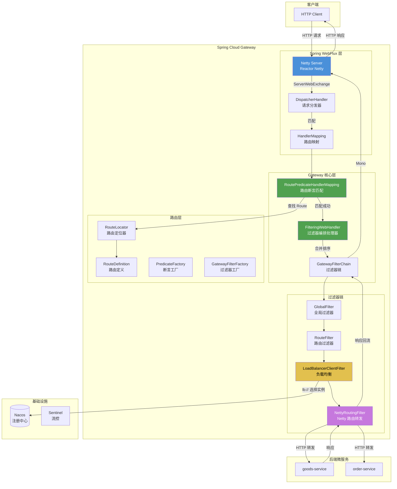

### 架构分层说明

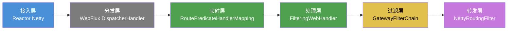

**关键设计理念：**
- **一切皆 Reactive**：整个请求处理链基于 `Mono<Void>` / `Flux<T>` 响应式流
- **责任链模式**：通过 `GatewayFilterChain` 串联所有过滤器
- **约定优于配置**：路由、断言、过滤器均支持配置化 + 工厂模式
- **不阻塞**：全程基于 Netty EventLoop，零线程阻塞

---

## 2. 核心组件总览

### 组件关系图

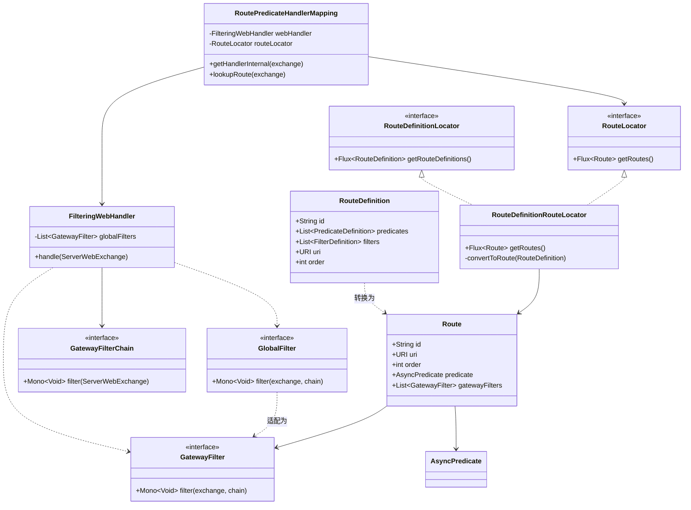

### 组件职责说明

| 组件 | 所在包 | 职责 |
|------|--------|------|
| `Route` | `gateway.route` | 运行时路由对象，包含 id、uri、predicate、filters |
| `RouteDefinition` | `gateway.route` | 配置态路由定义（对应 yaml 配置） |
| `RouteDefinitionLocator` | `gateway.route` | 路由定义加载器接口 |
| `RouteLocator` | `gateway.route` | 路由定位器接口，提供运行时路由 |
| `RouteDefinitionRouteLocator` | `gateway.route` | 将 `RouteDefinition` 转为 `Route` |
| `RoutePredicateHandlerMapping` | `gateway.handler` | 匹配请求与路由 |
| `FilteringWebHandler` | `gateway.handler` | 编排全局过滤器 + 路由过滤器 |
| `GatewayFilterChain` | `gateway.filter` | 过滤器链，驱动过滤器执行 |
| `GlobalFilter` | `gateway.filter` | 全局过滤器接口（作用于所有路由） |
| `GatewayFilter` | `gateway.filter` | 路由过滤器接口（配置在路由上） |
| `GatewayFilterFactory` | `gateway.filter.factory` | 过滤器工厂，创建 `GatewayFilter` |
| `RoutePredicateFactory` | `gateway.handler.predicate` | 断言工厂，创建 `Predicate` |

---

## 3. 路由定义与加载机制

### 路由加载流程图

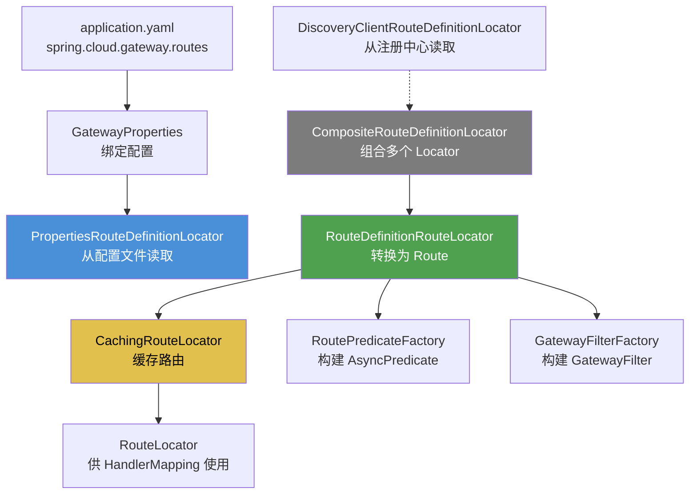

### 路由定义的多重加载来源

Spring Cloud Gateway 通过 **组合模式（Composite）** 支持多种路由来源：

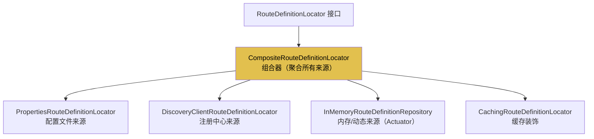

### 本项目路由配置解析

本项目 `application.yaml` 配置如下：

```yaml
spring:
  cloud:
    gateway:
      routes:
        - id: goods-service
          uri: lb://goods-service
          predicates:
            - Path=/goods/**
        - id: order-service
          uri: lb://order-service
          predicates:
            - Path=/order/**
```

经过 `GatewayProperties` 绑定后，每条路由被封装为 `RouteDefinition`：

```
RouteDefinition {
    id: "goods-service",
    uri: "lb://goods-service",
    predicates: [PredicateDefinition{name="Path", args={_genkey_0="/goods/**"}}],
    filters: [],
    order: 0
}
```

### RouteDefinition 转 Route 的过程

`RouteDefinitionRouteLocator.convertToRoute()` 将配置态转为运行态：

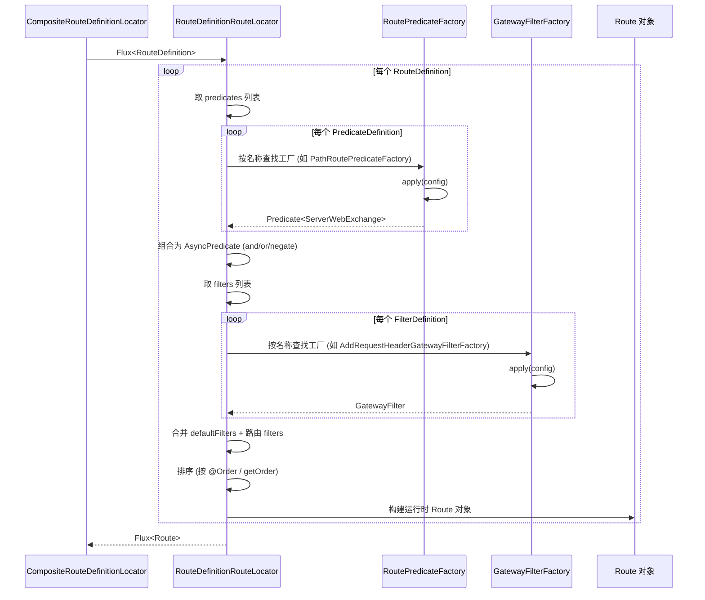

---

## 4. 路由转发底层原理

### 核心原理：HandlerMapping + WebHandler

Spring Cloud Gateway 复用 Spring WebFlux 的请求处理骨架：

```mermaid
flowchart LR
    A["HTTP 请求"] --> B["Reactor Netty Server"]
    B --> C["HttpWebHandlerAdapter"]
    C --> D["DispatcherHandler<br/>WebFlux 分发器"]
    D --> E["HandlerMapping 列表"]
    E --> F["RoutePredicateHandlerMapping<br/>Gateway 的核心 Mapping"]
    F --> G["FilteringWebHandler<br/>Gateway 的核心 Handler"]
    G --> H["GatewayFilterChain<br/>过滤器链"]
    H --> I["NettyRoutingFilter<br/>真正转发到后端"]
```

### RoutePredicateHandlerMapping 的核心逻辑

`RoutePredicateHandlerMapping` 继承自 `AbstractHandlerMapping`，重写 `getHandlerInternal()`：

```java
// 核心方法伪代码（基于 2.1.1 源码）
@Override
protected Mono<?> getHandlerInternal(ServerWebExchange exchange) {
    if (managementPortType == DIFFERENT && managementPort != null) {
        // 管理端口请求不走网关
        if (!managementPort.equals(exchange.getRequest().getURI().getPort())) {
            return Mono.empty();
        }
    }
    if (managementPortType == SAME && managementPort != null) {
        // 同端口但管理路径请求不走网关
        ...
    }
    return lookupRoute(exchange)
        .flatMap(route -> {
            exchange.getAttributes().put(GATEWAY_ROUTE_ATTR, route);  // 关键：把匹配到的 Route 放入 exchange 属性
            return Mono.just(webHandler);                              // 返回 FilteringWebHandler
        })
        .switchIfEmpty(Mono.empty().then(...));
}

protected Mono<Route> lookupRoute(ServerWebExchange exchange) {
    return this.routeLocator.getRoutes()
        .concatMap(route -> Mono.just(route)
            .filter(r -> {
                exchange.getAttributes().put(GATEWAY_PREDICATE_ROUTE_ATTR, r.getId());
                return r.getPredicate().apply(exchange);   // 核心：执行断言匹配
            })
            .doOnError(e -> ...)
            .onErrorResume(e -> Mono.empty())
        )
        .next();   // 取第一个匹配的
}
```

### 路由匹配原理

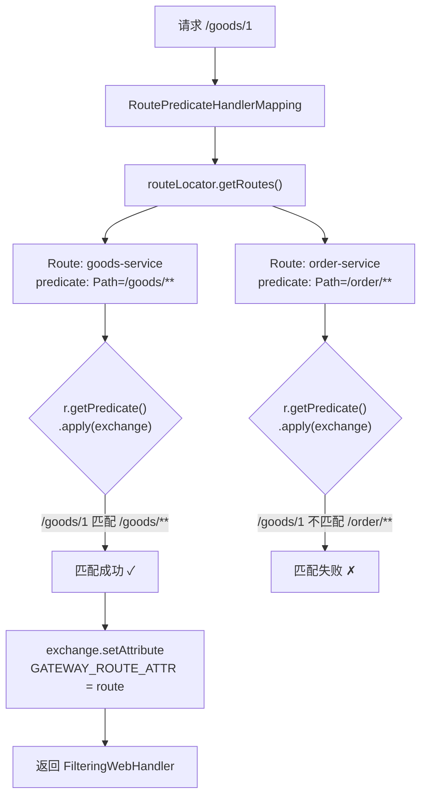

---

## 5. 过滤器链机制

### FilteringWebHandler 的核心编排逻辑

这是 Gateway 最核心的设计——**将全局过滤器与路由过滤器合并、排序、组成责任链**：

```java
// FilteringWebHandler.handle() 源码还原
@Override
public Mono<Void> handle(ServerWebExchange exchange) {
    // 1. 从 exchange 取出匹配的 Route（由 RoutePredicateHandlerMapping 放入）
    Route route = exchange.getRequiredAttribute(GATEWAY_ROUTE_ATTR);

    // 2. 取出该路由配置的过滤器（Route Filter）
    List<GatewayFilter> gatewayFilters = route.getFilters();

    // 3. 合并：全局过滤器 + 路由过滤器
    List<GatewayFilter> combined = new ArrayList<>(this.globalFilters);
    combined.addAll(gatewayFilters);

    // 4. 排序：按 @Order / getOrder() 排序
    combined.sort(AnnotationAwareOrderComparator.INSTANCE);

    // 5. 创建过滤器链并执行
    return new DefaultGatewayFilterChain(combined).filter(exchange);
}
```

### 过滤器链的责任链模式

```mermaid
graph LR
    A["FilteringWebHandler"] --> B["DefaultGatewayFilterChain<br/>filters=(f1, f2, ..., fn)"]
    B --> C["filter ①: AdaptCachedBodyGlobalFilter<br/>order=Integer.MIN_VALUE+1000"]
    C -->|chain.filter(exchange)| D["filter ②: GatewayMetricsFilter"]
    D -->|chain.filter(exchange)| E["filter ③: RouteToRequestUrlFilter<br/>解析 lb:// 为 URI"]
    E -->|chain.filter(exchange)| F["filter ④: LoadBalancerClientFilter<br/>选择实例 IP:Port"]
    F -->|chain.filter(exchange)| G["filter 末: NettyRoutingFilter<br/>真正 HTTP 转发"]
    G -->|转发到后端| H["goods-service:port"]
    H -->|响应回流| I["Mono 回溯执行后半部分"]
```

### DefaultGatewayFilterChain 递归调用原理

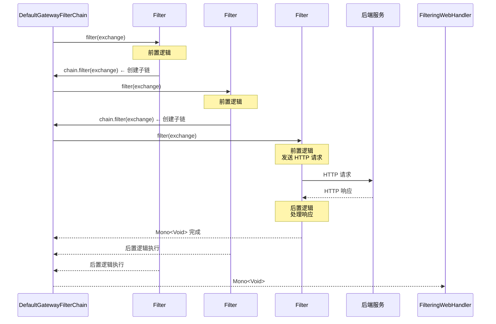

### 过滤器分类

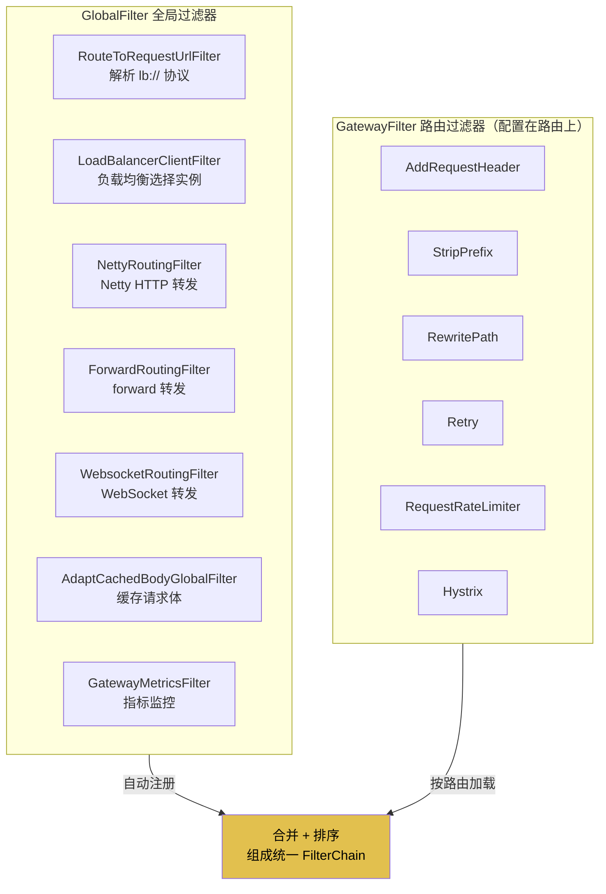

---

## 6. Filter 执行顺序详解

> 以下 Order 值来自 `javap` 反编译 `spring-cloud-gateway-core-2.1.1.RELEASE.jar` 的真实字节码常量。

### 执行顺序全景表

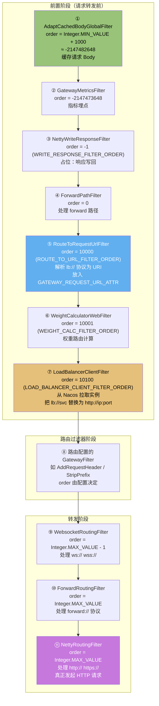

### 各 Filter 职责与 Order 对照表

| 序号 | Filter 类名 | Order 常量 | Order 值 | 职责 |
|------|------------|-----------|---------|------|
| ① | `AdaptCachedBodyGlobalFilter` | — | `Integer.MIN_VALUE + 1000`<br/>(-2147482648) | 缓存请求体到 exchange 属性，供后续重复读取 |
| ② | `GatewayMetricsFilter` | — | `-2147473648` | 收集网关指标（请求计数、耗时） |
| ③ | `NettyWriteResponseFilter` | `WRITE_RESPONSE_FILTER_ORDER` | `-1` | 将下游响应写回客户端（前置注册，后置执行） |
| ④ | `ForwardPathFilter` | — | `0` | 处理 `forward:` 协议路径 |
| ⑤ | `RouteToRequestUrlFilter` | `ROUTE_TO_URL_FILTER_ORDER` | `10000` | 解析路由 URI，放入 `GATEWAY_REQUEST_URL_ATTR` |
| ⑥ | `WeightCalculatorWebFilter` | `WEIGHT_CALC_FILTER_ORDER` | `10001` | 基于权重的路由分发 |
| ⑦ | `LoadBalancerClientFilter` | `LOAD_BALANCER_CLIENT_FILTER_ORDER` | `10100` | **核心**：`lb://` 协议解析 + Ribbon/LoadBalancer 选实例 |
| ⑧ | 路由 GatewayFilter | — | 配置指定 | `AddRequestHeader`/`StripPrefix`/`RewritePath`/`Retry` 等 |
| ⑨ | `WebsocketRoutingFilter` | — | `Integer.MAX_VALUE - 1`<br/>(2147483646) | WebSocket 协议转发 |
| ⑩ | `ForwardRoutingFilter` | — | `Integer.MAX_VALUE`<br/>(2147483647) | `forward:` 协议本地转发 |
| ⑪ | `NettyRoutingFilter` | — | `Integer.MAX_VALUE`<br/>(2147483647) | **核心**：HTTP/HTTPS 真正转发到后端 |

### Order 数轴可视化

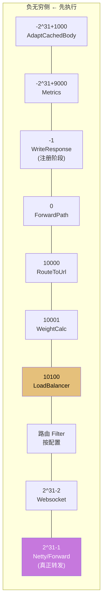

### 关键设计：为什么 NettyRoutingFilter Order 是 Integer.MAX_VALUE？

这是一个**精妙的设计**——NettyRoutingFilter 排在最后，意味着：

1. 所有前置 Filter 都有机会修改请求（加头、改路径、限流）
2. 只有当请求**没有被 forward:// 或 ws:// 处理**时，才走 Netty HTTP 转发
3. NettyRoutingFilter 内部会判断 URI scheme，只处理 `http`/`https`，其他 scheme 直接放行给下一个 Filter

```java
// NettyRoutingFilter.filter() 核心逻辑
public Mono<Void> filter(ServerWebExchange exchange, GatewayFilterChain chain) {
    URI requestUrl = exchange.getRequiredAttribute(GATEWAY_REQUEST_URL_ATTR);
    String scheme = requestUrl.getScheme();
    // 已被 forward 或 ws 处理过 → 跳过
    if (isAlreadyRouted(exchange) || (!"http".equals(scheme) && !"https".equals(scheme))) {
        return chain.filter(exchange);
    }
    setAlreadyRouted(exchange);
    // 真正通过 Reactor Netty HttpClient 转发
    return this.httpClient.request(...)...;
}
```

---

## 7. Predicate 断言机制

### 内置 Predicate 工厂

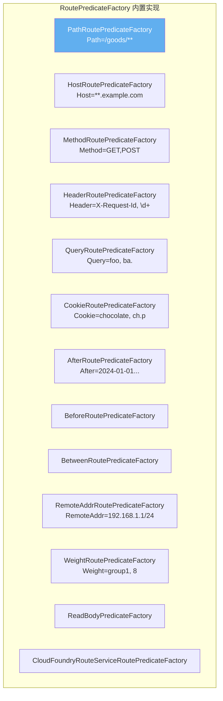

### PathRoutePredicateFactory 实现原理

本项目使用的 `Path=/goods/**` 断言，其底层基于 Spring 的 `PathPatternParser`：

```java
// PathRoutePredicateFactory.apply() 源码还原
@Override
public Predicate<ServerWebExchange> apply(Config config) {
    List<PathPattern> pathPatterns = new ArrayList<>();
    for (String pattern : config.getPatterns()) {
        pathPatterns.add(this.pathPatternParser.parse(pattern));  // 解析 /goods/**
    }
    return exchange -> {
        PathContainer path = parsePath(exchange.getRequest().getURI().getPath());
        for (PathPattern pathPattern : pathPatterns) {
            if (pathPattern.matches(path)) {   // 路径模式匹配
                traceMatch("Path", pathPattern, path, true);
                return true;
            }
        }
        return false;
    };
}
```

### 断言组合机制

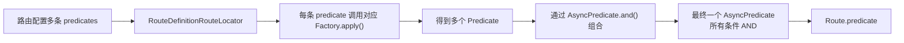

---

## 8. 请求处理完整时序

### 完整请求时序图（以 `GET /goods/1` 为例）

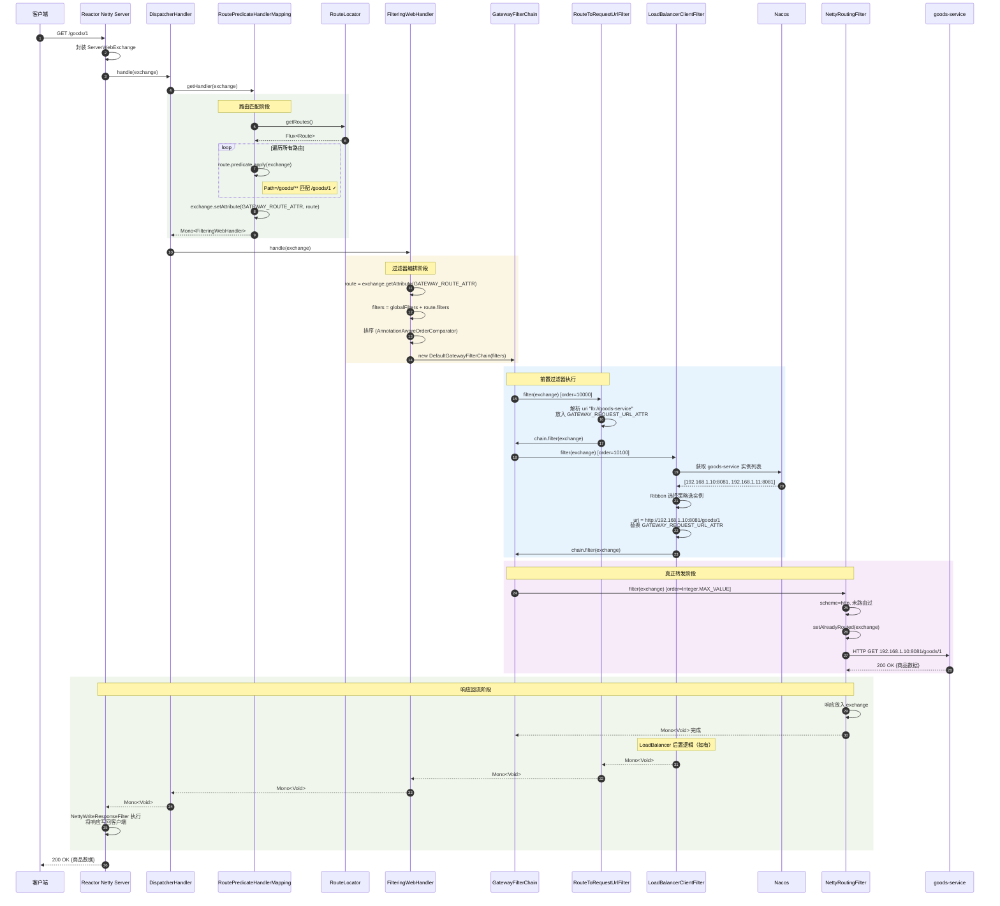

### 简化版执行流程

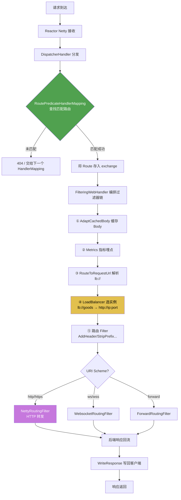

---

## 9. 底层通信原理（Reactor Netty）

### 为什么 Gateway 性能高？

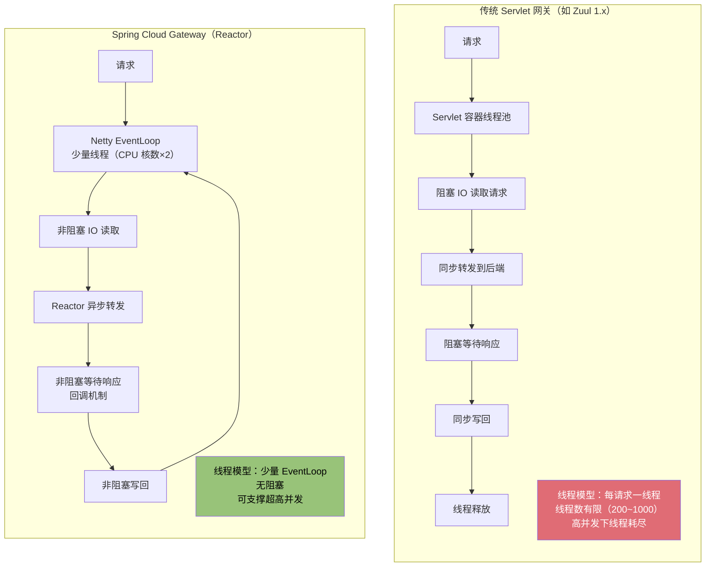

### Reactor 响应式编程模型

整个 Gateway 基于 Project Reactor 的 `Mono` / `Flux`：

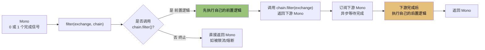

### 前置/后置逻辑的经典写法

```java
// 这是 Gateway Filter 的典型写法
public Mono<Void> filter(ServerWebExchange exchange, GatewayFilterChain chain) {
    // ============ 前置逻辑（请求阶段执行）============
    String something = exchange.getRequest().getHeaders().getFirst("X-Something");
    log.info("前置逻辑：请求处理中");
    exchange.getRequest().mutate().header("X-Gateway", "true").build();

    // ============ 放行到下一个 Filter ============
    return chain.filter(exchange)
        .then(Mono.fromRunnable(() -> {
            // ============ 后置逻辑（响应阶段执行）============
            log.info("后置逻辑：响应已返回");
        }));
    // .then() 在上游 Mono 完成后才执行
}
```

### NettyRoutingFilter 的真正转发实现

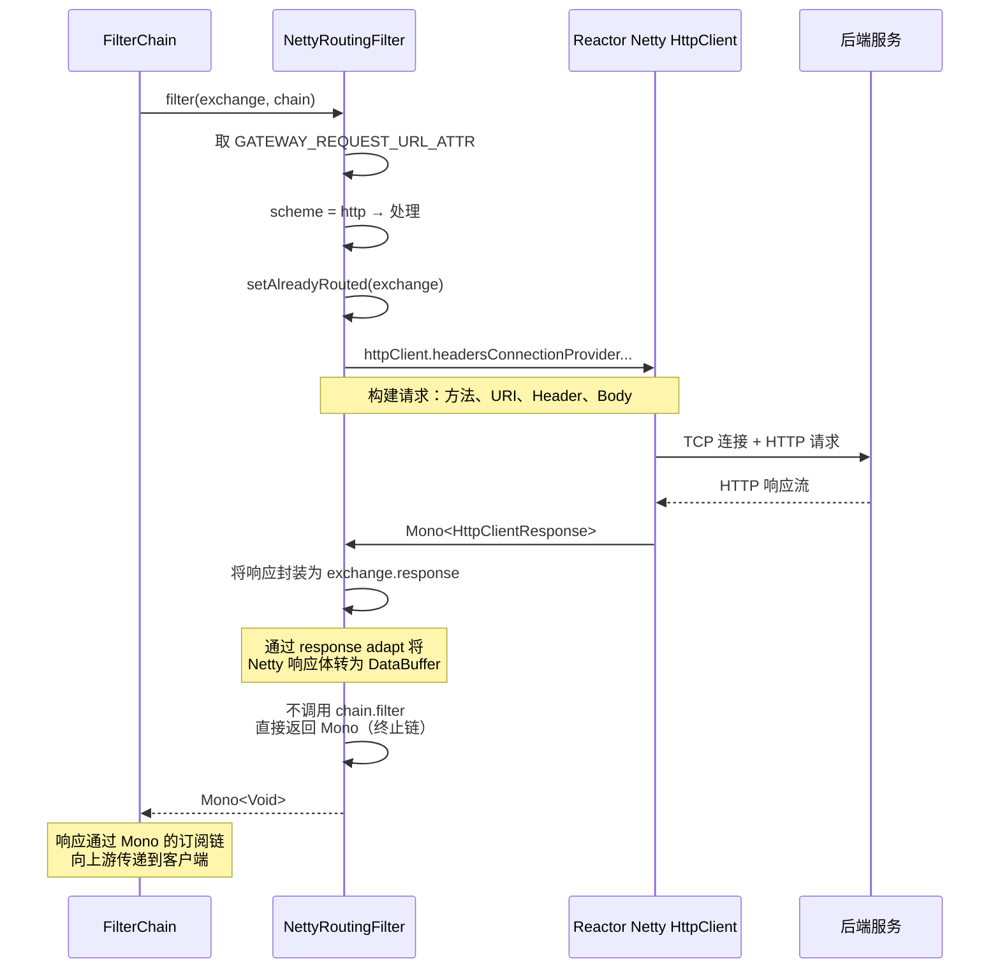

---

## 10. 本项目源码结合分析

### 项目结构与依赖

```mermaid
graph TD
    subgraph Parent["springcloud-sentinel-gateway-demo (parent)"]
        subgraph GW["gateway-server :9000"]
            GW1["GatewayServerApplication<br/>启动类"]
            GW2["SentinelGatewayConfiguration<br/>Sentinel 过滤器配置"]
            GW3["application.yaml<br/>路由规则"]
        end
        subgraph Goods["goods-service"]
            G1[GoodsApplication]
            G2[GoodsController]
        end
    end

    subgraph Deps["关键依赖"]
        D1["spring-cloud-starter-gateway<br/>Hoxton.SR12"]
        D2["spring-cloud-starter-alibaba-sentinel"]
        D3["sentinel-spring-cloud-gateway-adapter<br/>1.8.6"]
        D4["spring-cloud-starter-alibaba-nacos-discovery"]
    end

    GW --> Deps
```

### Sentinel 与 Gateway 的集成机制

本项目的 `SentinelGatewayConfiguration` 注册了两个 Bean：

```java
@Bean
@Order(Ordered.HIGHEST_PRECEDENCE)
public SentinelGatewayBlockExceptionHandler sentinelGatewayBlockExceptionHandler() {
    return new SentinelGatewayBlockExceptionHandler(viewResolvers, serverCodecConfigurer);
}

@Bean
@Order(Ordered.HIGHEST_PRECEDENCE)
public GlobalFilter sentinelGatewayFilter() {
    return new SentinelGatewayFilter();  // Sentinel 限流过滤器
}
```

### Sentinel 过滤器在 Gateway 链中的位置

```mermaid
graph LR
    A["AdaptCachedBody<br/>order≈-2.1B"] --> B["SentinelGatewayFilter<br/>order=Integer.MIN_VALUE<br/>@HIGHEST_PRECEDENCE<br/>★ 限流检查"]
    B --> C["GatewayMetrics<br/>order≈-2.1B+9000"]
    C --> D["RouteToRequestUrl<br/>order=10000"]
    D --> E["LoadBalancerClient<br/>order=10100"]
    E --> F["NettyRoutingFilter<br/>order=Integer.MAX_VALUE"]

    style B fill:#e06c75,color:#fff
```

### Sentinel 限流执行流程

```mermaid
sequenceDiagram
    participant Chain as GatewayFilterChain
    participant SGF as SentinelGatewayFilter
    participant SphU as Sentinel SphU
    participant Slot as SlotChain<br/>ProcessorSlot
    participant Flow as FlowSlot
    participant Next as 下游 Filter

    Chain->>SGF: filter(exchange, chain)
    SGF->>SGF: 提取资源名<br/>（路由 ID 或 URL）
    SGF->>SphU: asyncEntry(资源名)
    SphU->>Slot: 进入 SlotChain
    Slot->>Slot: NodeSelectorSlot<br/>构建统计节点
    Slot->>Slot: ClusterBuilderSlot<br/>集群统计
    Slot->>Slot: StatisticSlot<br/>QPS/线程统计
    Slot->>Flow: 检查流控规则
    alt 未超阈值
        Flow-->>SphU: 通过
        SphU-->>SGF: entry 创建成功
        SGF->>Next: chain.filter(exchange)
        Next-->>SGF: Mono<Void>
        SGF->>SphU: entry.exit()
    else 超过阈值
        Flow-->>SphU: BlockException
        SphU-->>SGF: BlockException
        SGF->>SGF: 调用 BlockExceptionHandler
        SGF-->>Chain: 返回限流响应（429）
    end
```

### 本项目完整请求处理链（结合 Sentinel）

```mermaid
flowchart TD
    A["GET http://localhost:9000/goods/1"] --> B["Reactor Netty :9000"]
    B --> C["DispatcherHandler"]
    C --> D["RoutePredicateHandlerMapping"]
    D --> E["匹配 Route: goods-service<br/>Path=/goods/**"]
    E --> F["FilteringWebHandler"]
    F --> G["合并过滤器链"]

    subgraph Chain["过滤器链执行（按 order 升序）"]
        direction TB
        H1["① AdaptCachedBodyGlobalFilter<br/>缓存 Body"]
        H2["② SentinelGatewayFilter<br/>★ Sentinel 限流检查<br/>资源名: goods-service 或 /goods/**"]
        H3["③ RouteToRequestUrlFilter<br/>解析 lb://goods-service"]
        H4["④ LoadBalancerClientFilter<br/>Nacos 拉取 goods-service 实例<br/>选 192.168.x.x:port"]
        H5["⑤ NettyRoutingFilter<br/>HTTP 转发到实例"]
    end

    G --> H1 --> H2 --> H3 --> H4 --> H5
    H5 --> I["goods-service 返回商品数据"]
    I --> J["响应回流到客户端"]

    H2 -.->|限流触发| K["SentinelGatewayBlockExceptionHandler<br/>返回 429 限流响应"]

    style H2 fill:#e06c75,color:#fff
    style H4 fill:#e5c07b,color:#000
    style H5 fill:#c678dd,color:#fff
```

---

## 11. 关键源码类索引

### 源码包结构

```
org.springframework.cloud.gateway
├── actuate/                      # Actuator 端点（GatewayControllerEndpoint）
├── config/                       # 自动配置
│   ├── GatewayAutoConfiguration          # ★ 核心 Bean 装配
│   ├── GatewayProperties                # 配置绑定 (spring.cloud.gateway.*)
│   ├── GatewayLoadBalancerClientAutoConfiguration
│   └── HttpClientProperties
├── discovery/                   # 服务发现路由
│   └── DiscoveryClientRouteDefinitionLocator
├── event/                       # 事件（RefreshRoutesEvent 等）
├── filter/                      # ★ 过滤器核心
│   ├── GatewayFilter.java               # 路由过滤器接口
│   ├── GlobalFilter.java                # 全局过滤器接口
│   ├── GatewayFilterChain.java          # 过滤器链接口
│   ├── RouteToRequestUrlFilter          # order=10000
│   ├── LoadBalancerClientFilter         # order=10100
│   ├── NettyRoutingFilter               # order=Integer.MAX_VALUE ★
│   ├── NettyWriteResponseFilter          # order=-1
│   ├── ForwardRoutingFilter             # order=Integer.MAX_VALUE
│   ├── WebsocketRoutingFilter           # order=Integer.MAX_VALUE-1
│   ├── WeightCalculatorWebFilter        # order=10001
│   ├── AdaptCachedBodyGlobalFilter
│   ├── GatewayMetricsFilter
│   ├── FilterDefinition                 # 过滤器配置定义
│   ├── headers/                         # HTTP 头处理过滤器
│   ├── factory/                         # ★ 过滤器工厂
│   │   ├── GatewayFilterFactory         # 工厂接口
│   │   ├── AbstractGatewayFilterFactory
│   │   ├── AddRequestHeaderGatewayFilterFactory
│   │   ├── StripPrefixGatewayFilterFactory
│   │   ├── RewritePathGatewayFilterFactory
│   │   ├── RetryGatewayFilterFactory
│   │   ├── RequestRateLimiterGatewayFilterFactory
│   │   └── HystrixGatewayFilterFactory
│   ├── ratelimit/                       # 限流
│   └── rewrite/                         # 请求/响应体改写
├── handler/                     # ★ 处理器
│   ├── FilteringWebHandler              # ★ 过滤器编排核心
│   ├── RoutePredicateHandlerMapping     # ★ 路由匹配核心
│   ├── AsyncPredicate                   # 异步断言
│   └── predicate/                       # ★ 断言工厂
│       ├── RoutePredicateFactory
│       ├── AbstractRoutePredicateFactory
│       ├── PathRoutePredicateFactory
│       ├── HostRoutePredicateFactory
│       ├── MethodRoutePredicateFactory
│       ├── HeaderRoutePredicateFactory
│       └── ...
├── route/                       # ★ 路由
│   ├── Route.java                       # 运行时路由
│   ├── RouteDefinition                  # 配置态路由
│   ├── RouteLocator                     # 路由定位器接口
│   ├── RouteDefinitionLocator           # 路由定义定位器接口
│   ├── RouteDefinitionRouteLocator      # ★ Definition→Route 转换
│   ├── CompositeRouteDefinitionLocator  # 组合定位器
│   ├── CachingRouteLocator              # 缓存装饰器
│   ├── InMemoryRouteDefinitionRepository
│   └── builder/                         # Route DSL 构建器
├── support/                    # 工具
│   ├── ServerWebExchangeUtils           # ★ exchange 属性常量定义
│   └── ShortcutConfigurable
└── actuate/                    # 监控端点
```

### 关键 exchange 属性键（ServerWebExchangeUtils）

```mermaid
graph LR
    subgraph Exchange["ServerWebExchange Attributes 属性流转"]
        A1["GATEWAY_ROUTE_ATTR<br/>= RoutePredicateHandlerMapping 放入<br/>匹配到的 Route 对象"]
        A2["GATEWAY_PREDICATE_ROUTE_ATTR<br/>= 当前匹配中的 Route ID"]
        A3["GATEWAY_REQUEST_URL_ATTR<br/>= RouteToRequestUrlFilter 放入<br/>解析后的请求 URI（含 lb://）"]
        A4["GATEWAY_SCHEME_PREFIX_ATTR<br/>= 协议前缀 lb"]
        A5["GATEWAY_ALREADY_ROUTED_ATTR<br/>= NettyRoutingFilter 标记已转发<br/>防止重复路由"]
        A6["CLIENT_RESPONSE_ATTR<br/>= Netty 响应对象"]
        A7["CACHED_REQUEST_BODY_ATTR<br/>= 缓存的请求体"]

        A1 --> A3 --> A5 --> A6
    end

    style A1 fill:#50a14f,color:#fff
    style A3 fill:#61afef,color:#fff
    style A5 fill:#c678dd,color:#fff
```

### 属性在各 Filter 间的流转

```mermaid
sequenceDiagram
    participant RPHM as RoutePredicateHandlerMapping
    participant RTU as RouteToRequestUrlFilter
    participant LB as LoadBalancerClientFilter
    participant NRF as NettyRoutingFilter

    RPHM->>RPHM: exchange.put(GATEWAY_ROUTE_ATTR, route)
    Note over RPHM: route.uri = "lb://goods-service"

    RTU->>RTU: 读取 GATEWAY_ROUTE_ATTR
    RTU->>RTU: 解析 uri, scheme=lb
    RTU->>RTU: exchange.put(GATEWAY_REQUEST_URL_ATTR, lb://goods-service/goods/1)
    RTU->>RTU: exchange.put(GATEWAY_SCHEME_PREFIX_ATTR, "lb")

    LB->>LB: 读取 GATEWAY_REQUEST_URL_ATTR
    LB->>LB: lb:// → 查 Nacos → 选实例
    LB->>LB: uri = http://192.168.1.10:8081/goods/1
    LB->>LB: exchange.put(GATEWAY_REQUEST_URL_ATTR, http://192.168.1.10:8081/goods/1)

    NRF->>NRF: 读取 GATEWAY_REQUEST_URL_ATTR
    NRF->>NRF: scheme=http → 转发
    NRF->>NRF: exchange.put(GATEWAY_ALREADY_ROUTED_ATTR, true)
    NRF->>NRF: 通过 HttpClient 发起请求
    NRF->>NRF: exchange.put(CLIENT_RESPONSE_ATTR, response)
```

---

## 12. lb 协议路由转发原理

### 12.1 lb:// 的本质

`lb://` **不是真正的网络协议**，它是 Spring Cloud Gateway 定义的一个**虚拟协议标识**（lb = Load Balancer），告诉网关："这个 URI 的目标地址需要从注册中心动态获取，并做负载均衡选择"。

`lb://` 本身无法被任何 HTTP 客户端识别，必须经过两个 Filter 的"接力转换"，最终变成 `http://ip:port/path` 才能被真正转发。

### 12.2 核心机制：两个 Filter 的接力

```mermaid
graph LR
    subgraph S1["① RouteToRequestUrlFilter<br/>order=10000"]
        A1["读取 Route.uri<br/>lb://goods-service"]
        A2["拼接请求路径<br/>lb://goods-service/goods/1"]
        A3["写入 exchange 属性<br/>GATEWAY_REQUEST_URL_ATTR"]
    end

    subgraph S2["② LoadBalancerClientFilter<br/>order=10100"]
        B1["识别 scheme=lb"]
        B2["loadBalancer.choose<br/>从 Nacos 选实例"]
        B3["reconstructURI<br/>重写为 http://192.168.1.10:8081/goods/1"]
        B4["覆盖 GATEWAY_REQUEST_URL_ATTR"]
    end

    subgraph S3["③ NettyRoutingFilter<br/>order=Integer.MAX_VALUE"]
        C1["识别 scheme=http"]
        C2["HttpClient 真正发起<br/>HTTP 请求"]
    end

    S1 --> S2 --> S3

    style S1 fill:#61afef,color:#fff
    style S2 fill:#e5c07b,color:#000
    style S3 fill:#c678dd,color:#fff
```

`lb://` 的转换被**刻意拆成两步**，这是高内聚低耦合的设计：

- `RouteToRequestUrlFilter` 只负责"路由 URI 与请求路径的拼接"--它对 lb 一无所知
- `LoadBalancerClientFilter` 只负责"lb 协议的解析与实例选择"--它不关心路径怎么来

这样，未来若要支持新的服务发现协议（如 Nacos 自带协议），只需新增/替换 `LoadBalancerClientFilter`，不影响其他环节。

### 12.3 第一步：RouteToRequestUrlFilter 解析路由 URI

#### 源码核心逻辑（基于 2.1.1）

```java
public class RouteToRequestUrlFilter implements GlobalFilter, Ordered {

    public static final int ROUTE_TO_URL_FILTER_ORDER = 10000;

    // 匹配形如 "xxx:..." 的 scheme（如 lb:、http:、https:）
    private static final String SCHEME_REGEX = "[a-zA-Z]([a-zA-Z]|\\d|\\+|\\.|-)*:.*";
    static final Pattern schemePattern = Pattern.compile(SCHEME_REGEX);

    @Override
    public Mono<Void> filter(ServerWebExchange exchange, GatewayFilterChain chain) {
        // 1. 取出 RoutePredicateHandlerMapping 放入的 Route 对象
        Route route = exchange.getAttribute(GATEWAY_ROUTE_ATTR);
        if (route == null) {
            return chain.filter(exchange);
        }
        log.trace("Route to url: " + route.getId());

        // 2. 取出路由配置的 URI（本例 = lb://goods-service）
        URI routeUri = route.getUri();

        // 3. 判断是否"另一个 scheme 已嵌在请求路径里"（如 forward:/xxx）
        boolean anotherScheme = hasAnotherScheme(exchange.getRequest().getURI());

        // 4. 组合 scheme + host + path
        URI requestUrl = UriComponentsBuilder.fromUri(exchange.getRequest().getURI())
            .scheme(anotherScheme ? exchange.getRequest().getURI().getScheme() : routeUri.getScheme())
            .host(routeUri.getHost())      // goods-service
            .port(routeUri.getPort())
            .build(anotherScheme)
            .toUri();

        // 5. 把 scheme 前缀单独存一份（LoadBalancerClientFilter 要用）
        exchange.getAttributes().put(GATEWAY_REQUEST_URL_ATTR, requestUrl);
        if (routeUri.getScheme() != null && schemePattern.matcher(routeUri.toString()).matches()) {
            exchange.getAttributes().put(GATEWAY_SCHEME_PREFIX_ATTR, routeUri.getScheme());
        }

        return chain.filter(exchange);
    }
}
```

#### 本项目执行结果

```mermaid
graph LR
    A["请求: GET /goods/1"] --> B["Route.uri: lb://goods-service"]
    B --> C["UriComponentsBuilder 拼接"]
    C --> D["requestUrl = lb://goods-service/goods/1"]
    D --> E["exchange 属性 GATEWAY_REQUEST_URL_ATTR"]
    F["routeUri.scheme='lb' 匹配 SCHEME_REGEX"] --> G["exchange 属性 GATEWAY_SCHEME_PREFIX_ATTR = 'lb'"]

    style D fill:#61afef,color:#fff
    style G fill:#50a14f,color:#fff
```

注意：**到这里 URI 仍然是 `lb://goods-service/goods/1`**，`lb` 这个 scheme 任何 HTTP 客户端都不认识，必须有下一步转换。

### 12.4 第二步：LoadBalancerClientFilter 解析 lb 协议并选实例

这是 `lb://` 真正被解析的核心。

#### 源码核心逻辑

```java
public class LoadBalancerClientFilter implements GlobalFilter, Ordered {

    public static final int LOAD_BALANCER_CLIENT_FILTER_ORDER = 10100;

    // 这是真正干活的"负载均衡客户端"（Ribbon 实现）
    protected final LoadBalancerClient loadBalancer;

    @Override
    public Mono<Void> filter(ServerWebExchange exchange, GatewayFilterChain chain) {
        // 1. 读取上一步写入的 URI
        URI url = exchange.getAttribute(GATEWAY_REQUEST_URL_ATTR);
        String schemePrefix = exchange.getAttribute(GATEWAY_SCHEME_PREFIX_ATTR);

        // 2. 关键判断：只有 scheme 是 "lb" 才处理
        //    (http/https/forward/ws 都直接跳过)
        if (url == null
            || (!"lb".equals(url.getScheme()) && !"lb".equals(schemePrefix))) {
            return chain.filter(exchange);
        }

        // 3. 保留原始 url（便于故障恢复/日志）
        exchange.getAttributes().put(GATEWAY_ORIGINAL_REQUEST_URL_ATTR, url);

        // 4. ★ 核心：调用 choose() 选择一个具体实例
        //    serviceId = url.getHost() = "goods-service"
        final ServiceInstance instance = choose(exchange);

        if (instance == null) {
            // 找不到可用实例 -> 抛 503
            throw NotFoundException.create(...);
        }

        // 5. ★ 核心：用实例信息重建 URI
        //    把 lb://goods-service/goods/1 重写为 http://192.168.1.10:8081/goods/1
        URI requestUrl = reconstructURI(instance, url);

        // 6. 覆盖 exchange 属性，供下一个 Filter (NettyRoutingFilter) 使用
        exchange.getAttributes().put(GATEWAY_REQUEST_URL_ATTR, requestUrl);
        return chain.filter(exchange);
    }

    protected ServiceInstance choose(ServerWebExchange exchange) {
        URI uri = exchange.getAttribute(GATEWAY_REQUEST_URL_ATTR);
        // 调用 Ribbon 客户端选实例
        return this.loadBalancer.choose(uri.getHost());
    }
}
```

#### choose() 是怎么选到实例的？--Ribbon 链路

`LoadBalancerClient` 是接口，本项目用的是 Netflix Ribbon 的实现 `RibbonLoadBalancerClient`：

```mermaid
sequenceDiagram
    autonumber
    participant LBCF as LoadBalancerClientFilter
    participant RLBC as RibbonLoadBalancerClient
    participant SCF as SpringClientFactory
    participant ILB as ILoadBalancer<br/>(ZoneAwareLoadBalancer)
    participant ServerList as NacosServerList
    participant Nacos as Nacos 注册中心

    LBCF->>RLBC: choose("goods-service")

    RLBC->>SCF: getLoadBalancer("goods-service")
    Note over SCF: 每个服务对应一个独立的<br/>ILoadBalancer 实例（缓存）

    alt ILoadBalancer 尚未创建
        SCF->>SCF: 创建 ZoneAwareLoadBalancer
        SCF->>ServerList: 初始化 ServerList（Nacos 实现）
        ServerList->>Nacos: HTTP 拉取 goods-service 实例列表
        Nacos-->>ServerList: [192.168.1.10:8081, 192.168.1.11:8081]
        ServerList-->>ILB: 填充 allServerList
    end
    SCF-->>RLBC: 返回 ILoadBalancer

    RLBC->>ILB: chooseServer(key)
    Note over ILB: 1. 先过滤：可用、健康<br/>2. 再按 Rule 选（默认 ZoneAvoidanceRule）

    alt 多个实例 -> 负载均衡
        ILB->>ILB: RoundRobin/ZoneAvoidance 算法选一个
    end
    ILB-->>RLBC: Server(192.168.1.10, 8081)

    RLBC->>RLBC: 封装为 RibbonServer
    RLBC-->>LBCF: 返回 ServiceInstance
```

#### reconstructURI() 是怎么重写 URL 的？

`RibbonLoadBalancerClient.reconstructURI()` 源码逻辑（从字节码还原）：

```java
public URI reconstructURI(ServiceInstance instance, URI original) {
    // instance = 选中的 192.168.1.10:8081
    // original  = lb://goods-service/goods/1

    String serviceId = instance.getServiceId();   // goods-service
    RibbonLoadBalancerContext context = factory.getLoadBalancerContext(serviceId);

    Server server;   // 192.168.1.10:8081
    URI updated;     // 处理 https 升级等

    if (instance instanceof RibbonServer) {
        RibbonServer ribbon = (RibbonServer) instance;
        server = ribbon.getServer();
        updated = RibbonUtils.updateToSecureConnectionIfNeeded(original, instance);
    } else { ... }

    // ★ 核心：用 Server 的 host/port 替换 URI 的 host/port
    return context.reconstructURIWithServer(server, updated);
}
```

最终 `reconstructURIWithServer()` 执行的等价操作：

```
原始 URI: lb://goods-service/goods/1
   scheme=lb, host=goods-service, port=-1, path=/goods/1

Server:   host=192.168.1.10, port=8081

重建 URI: http://192.168.1.10:8081/goods/1
   scheme=http, host=192.168.1.10, port=8081, path=/goods/1
```

### 12.5 第三步：NettyRoutingFilter 真正转发

```java
public class NettyRoutingFilter implements GlobalFilter, Ordered {

    public Mono<Void> filter(ServerWebExchange exchange, GatewayFilterChain chain) {
        URI requestUrl = exchange.getRequiredAttribute(GATEWAY_REQUEST_URL_ATTR);
        String scheme = requestUrl.getScheme();   // 现在是 "http"

        // 关键守卫：已被路由过 / 不是 http|https -> 跳过
        if (isAlreadyRouted(exchange) || (!"http".equals(scheme) && !"https".equals(scheme))) {
            return chain.filter(exchange);
        }
        setAlreadyRouted(exchange);

        // 用 Reactor Netty HttpClient 发起真正的 HTTP 请求
        return this.httpClient
            .request(HttpMethod.valueOf(exchange.getRequest().getMethodValue()))
            .uri(requestUrl)                          // http://192.168.1.10:8081/goods/1
            ...                                         // 拷贝 headers、body
            .responseConnection((resp, conn) -> {
                // 把下游响应挂回 exchange.response
            });
    }
}
```

到这一步，`lb://` 早已变成普通的 `http://`，Netty 完全认识，正常发起 TCP 连接 + HTTP 请求。

### 12.6 完整链路时序图

```mermaid
sequenceDiagram
    autonumber
    participant Client as 客户端
    participant RPHM as RoutePredicateHandlerMapping
    participant RTU as RouteToRequestUrlFilter<br/>order=10000
    participant LBCF as LoadBalancerClientFilter<br/>order=10100
    participant RLBC as RibbonLoadBalancerClient
    participant ILB as ILoadBalancer<br/>(ZoneAwareLoadBalancer)
    participant Nacos as Nacos
    participant NRF as NettyRoutingFilter<br/>order=MAX
    participant Goods as goods-service

    Client->>RPHM: GET /goods/1
    RPHM->>RPHM: 匹配 Route<br/>uri=lb://goods-service
    RPHM->>RPHM: exchange.put(GATEWAY_ROUTE_ATTR, route)

    RPHM->>RTU: filter(exchange)
    Note over RTU: 读取 route.uri = lb://goods-service<br/>拼接路径 -> lb://goods-service/goods/1
    RTU->>RTU: exchange.put(GATEWAY_REQUEST_URL_ATTR,<br/>lb://goods-service/goods/1)
    RTU->>RTU: exchange.put(GATEWAY_SCHEME_PREFIX_ATTR,<br/>"lb")

    RTU->>LBCF: chain.filter(exchange)
    Note over LBCF: scheme="lb" -> 进入负载均衡逻辑
    LBCF->>RLBC: choose("goods-service")

    RLBC->>ILB: getLoadBalancer("goods-service")

    alt ServerList 为空
        ILB->>Nacos: 拉取实例列表
        Nacos-->>ILB: [192.168.1.10:8081, 192.168.1.11:8081]
    end

    ILB->>ILB: ZoneAvoidanceRule 选择
    ILB-->>RLBC: Server(192.168.1.10, 8081)

    RLBC->>RLBC: reconstructURI(instance, lb://goods-service/goods/1)
    Note over RLBC: 替换 host/port -> http://192.168.1.10:8081/goods/1
    RLBC-->>LBCF: 返回重建后的 URI

    LBCF->>LBCF: exchange.put(GATEWAY_REQUEST_URL_ATTR,<br/>http://192.168.1.10:8081/goods/1)

    LBCF->>NRF: chain.filter(exchange)
    Note over NRF: scheme="http" -> 处理<br/>setAlreadyRouted=true
    NRF->>Goods: HTTP GET 192.168.1.10:8081/goods/1
    Goods-->>NRF: 200 OK {商品数据}
    NRF-->>Client: 响应回流
```

### 12.7 关键设计要点

#### 1. 为什么用 lb:// 而不是直接写 IP？

```mermaid
graph TB
    subgraph Direct["直接写 IP（不用 lb://）"]
        D1["硬编码 IP"] --> D2["实例宕机 -> 请求失败"]
        D2 --> D3["无法横向扩展"]
        D3 --> D4["无法负载均衡"]
    end

    subgraph LB["用 lb:// 虚拟协议"]
        L1["只写服务名 goods-service"] --> L2["运行时从注册中心拿实例列表"]
        L2 --> L3["多实例自动负载均衡"]
        L3 --> L4["实例宕机 -> 自动剔除<br/>列表刷新"]
    end

    style D4 fill:#e06c75,color:#fff
    style L4 fill:#98c379,color:#000
```

#### 2. Nacos 实例列表如何保持最新？

Ribbon 的 `ServerListUpdater` 会在后台**定时拉取**（默认 30 秒）最新的实例列表：

```mermaid
flowchart LR
    A["PollingServerListUpdater<br/>定时任务"] -->|每 30s| B["NacosServerList.getInitialListOfServers"]
    B --> C["Nacos HTTP 接口<br/>/nacos/v1/ns/instance/list"]
    C --> D["更新 ILoadBalancer.allServerList"]
    D --> E["chooseServer 时从最新列表选"]
```

#### 3. 默认负载均衡规则

本项目 `Hoxton.SR12 + spring-cloud-netflix-ribbon 2.2.10` 的默认规则是 `ZoneAvoidanceRule`：

| 规则类 | 算法 | 适用场景 |
|--------|------|---------|
| `RoundRobinRule` | 轮询 | 简单场景 |
| `ZoneAvoidanceRule` ★默认 | 综合区域+可用性过滤后轮询 | 多机房部署 |
| `RandomRule` | 随机 | - |
| `BestAvailableRule` | 选并发最小 | - |
| `WeightedResponseTimeRule` | 按响应时间加权 | 性能差异化实例 |

可通过 `goods-service.ribbon.NFLoadBalancerRuleClassName=com.netflix.loadbalancer.RandomRule` 覆盖。

### 12.8 lb:// 转换本质总结

```mermaid
graph LR
    A["lb://goods-service"] -->|本质| B["一个占位符协议"]
    B --> C["告诉 Gateway：<br/>这个 host 是服务名<br/>不是 IP"]
    C --> D["需要 LoadBalancer 解析"]
    D --> E["解析后变成<br/>http://实际IP:port"]

    style B fill:#61afef,color:#fff
    style E fill:#98c379,color:#000
```

**一句话总结**：

> `lb://goods-service` 是一个**虚拟协议标识**。`RouteToRequestUrlFilter`(order=10000) 先把它和请求路径拼成 `lb://goods-service/goods/1` 存入 exchange；`LoadBalancerClientFilter`(order=10100) 识别 `lb` scheme 后，调用 Ribbon 的 `ILoadBalancer` 从 Nacos 拉取的实例列表中选择一个（默认 `ZoneAvoidanceRule`），再用 `reconstructURI` 把服务名替换成真实 `IP:port`，重写成 `http://192.168.1.10:8081/goods/1`；最后 `NettyRoutingFilter`(order=Integer.MAX_VALUE) 看到的是普通的 `http` URI，正常发起转发。整个过程靠 **exchange 属性在三个 Filter 间传递**，实现了"路由解析"与"负载均衡"的解耦。

---

## 总结

### Spring Cloud Gateway 设计精髓

| 设计点 | 实现方式 | 优势 |
|--------|---------|------|
| **响应式全链路** | Mono/Flux + Reactor Netty | 无阻塞，高并发，少量线程 |
| **责任链模式** | GatewayFilterChain + DefaultGatewayFilterChain | 过滤器解耦，可插拔 |
| **工厂模式** | RoutePredicateFactory / GatewayFilterFactory | 配置化创建断言与过滤器 |
| **组合模式** | CompositeRouteDefinitionLocator | 多来源路由统一聚合 |
| **装饰器模式** | CachingRouteLocator 包装 RouteLocator | 按需增强（缓存、刷新） |
| **约定优于配置** | GatewayProperties + yaml 配置 | 零代码定义路由 |
| **HandlerMapping 复用** | 继承 AbstractHandlerMapping | 无缝接入 WebFlux 体系 |

### 三大核心流程

```mermaid
graph LR
    A["① 路由加载<br/>yaml → RouteDefinition → Route<br/>（启动时 + RefreshRoutesEvent）"]
    B["② 路由匹配<br/>RoutePredicateHandlerMapping<br/>遍历 Route 执行 predicate<br/>匹配成功放入 exchange"]
    C["③ 过滤器链执行<br/>FilteringWebHandler<br/>GlobalFilter + RouteFilter 合并排序<br/>chain.filter 驱动"]

    A --> B --> C

    style A fill:#61afef,color:#fff
    style B fill:#50a14f,color:#fff
    style C fill:#e5c07b,color:#000
```

### 本项目网关请求一句话总结

> 客户端请求 `GET /goods/1` → Reactor Netty 接收 → DispatcherHandler 分发 → **RoutePredicateHandlerMapping** 匹配到 `Path=/goods/**` 路由 → **FilteringWebHandler** 编排 [Sentinel限流 → RouteToRequestUrl 解析 lb:// → LoadBalancer 从 Nacos 选实例 → NettyRoutingFilter HTTP 转发] → goods-service 响应回流 → 写回客户端。